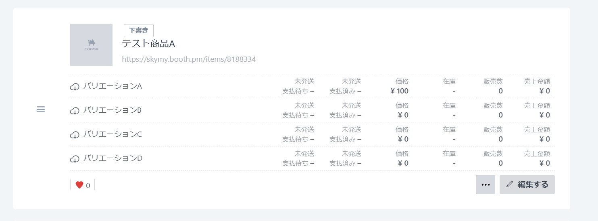
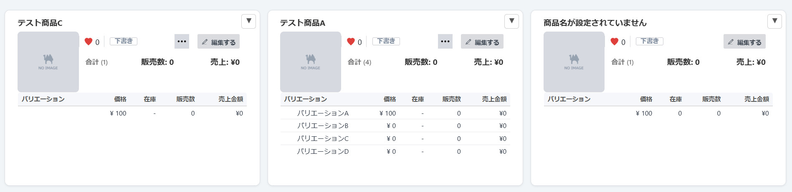
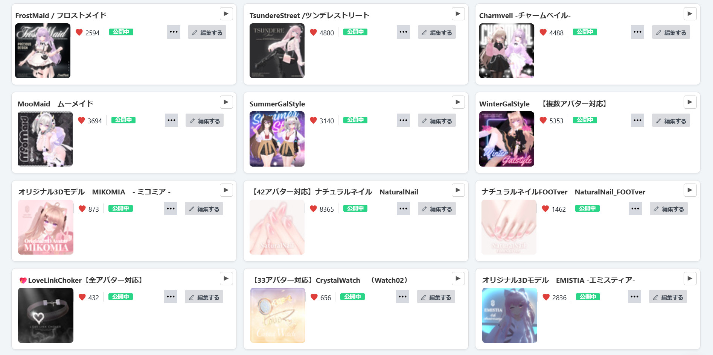
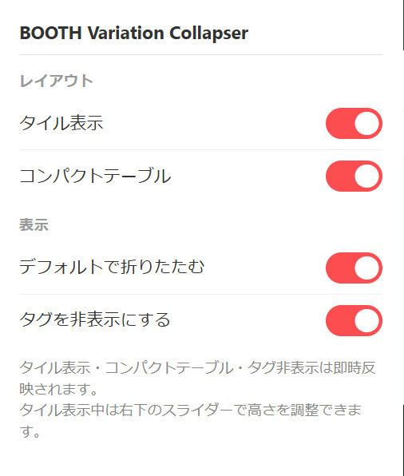

# Booth Manage View Enhancer

[BOOTH](https://booth.pm/) の商品管理画面（`manage.booth.pm/items`）で、商品一覧の表示をカスタマイズできる Chrome 拡張機能です。

> **Note:** 本拡張機能はBOOTH公式ではない非公式の拡張機能です。ピクシブ株式会社およびBOOTHとは一切関係ありません。

バリエーションが多い商品を扱っているショップでは、商品管理画面が非常に長くなりがちです。この拡張機能を使うことで、バリエーション一覧のコンパクト化・折りたたみ・タイル表示など、画面をすっきり整理できます。

## Before / After

### 拡張適用前

BOOTHの標準的な商品一覧表示です。バリエーションが縦に長く展開され、商品数が多いとスクロール量が増大します。



### 拡張適用後

コンパクトテーブルとタイル表示により、情報が整理され一覧性が大幅に向上します。



## 機能

### タイル表示



- 横長のリスト表示を **タイル型のグリッドレイアウト** に切り替え
- 画面幅に応じて自動的にカラム数が変化し、画面いっぱいにタイルを配置
- 商品名がタイル上部に表示され、サムネイル横にスキ数・ステータス・ボタンを配置
- 右下のスライダーでタイルの高さを調整可能（250px〜800px）

### コンパクトテーブル
- バリエーション一覧を **テーブル形式にコンパクト化**
- バリエーション名・価格・在庫・販売数・売上金額を一覧表示
- 合計（バリエーション数・販売数・売上金額）をテーブル上部に常時表示

### 折りたたみ
- 各商品の右上に **▼ ボタン** を追加
- クリックでバリエーション一覧をスムーズに折りたたみ/展開
- タイル表示時は折りたたむとタイル自体もコンパクトに縮小

### タグ非表示
- 商品に設定されたタグ一覧を非表示にしてすっきり表示

### 合計サマリー非表示
- 各商品の「合計 (N) 販売数: X 売上: ¥Y」表示を非表示にできる

### 設定の同期
- すべての設定は Chrome の同期ストレージに保存され、複数デバイス間で共有

## インストール方法

1. このリポジトリをクローンまたはダウンロードします
   ```
   git clone https://github.com/SKYMY-Workshop/Booth-Manage-View-Enhancer.git
   ```
2. Chrome で `chrome://extensions/` を開きます
3. 右上の **「デベロッパーモード」** を ON にします
4. **「パッケージ化されていない拡張機能を読み込む」** をクリックします
5. `src/` フォルダを選択します

## 使い方

### ポップアップ設定

Chrome ツールバーの拡張機能アイコンをクリックすると設定パネルが開きます。



| 設定 | 説明 | 反映 |
|---|---|---|
| **タイル表示** | リスト表示をタイル型グリッドに切り替え | 即時 |
| **コンパクトテーブル** | バリエーション一覧をテーブル形式に変換 | 即時 |
| **デフォルトで折りたたむ** | ページを開いた時に折りたたんだ状態にする | 再読み込み後 |
| **タグを非表示にする** | タグ一覧を非表示 | 即時 |
| **合計サマリーを非表示** | 合計（販売数・売上）の表示を非表示 | 即時 |

### バリエーションの折りたたみ

1. [BOOTH 商品管理画面](https://manage.booth.pm/items) を開きます
2. 各商品の右上に表示される **▼ ボタン** をクリックします
3. バリエーション一覧が折りたたまれます。もう一度クリックすると展開します

### タイルの高さ調整

タイル表示中は画面右下にスライダーが表示されます。スライダーを動かすことでタイルの高さを調整できます。

## ファイル構成

```
Booth Manage View Enhancer/
├── README.md
├── PRIVACY_POLICY.md           # プライバシーポリシー
├── src/                        # 拡張機能本体（このフォルダを読み込む）
│   ├── manifest.json           # マニフェスト (Manifest V3)
│   ├── content.js              # 商品管理画面のUI改修スクリプト
│   ├── content.css             # レイアウト・アニメーションのスタイル
│   ├── popup.html              # 設定ポップアップの UI
│   ├── popup.js                # 設定の保存・読み込み
│   └── icons/
│       ├── icon16.png
│       ├── icon32.png
│       ├── icon48.png
│       └── icon128.png
└── docs/
    ├── before.jpg
    ├── after.jpg
    └── tile.jpg
```

## 動作要件

| ブラウザ | 対応状況 |
|---------|---------|
| Google Chrome | Manifest V3 |

- BOOTH のショップアカウント（商品管理画面へのアクセスが必要）

## プライバシー

この拡張機能は外部サーバーへの通信を一切行いません。すべての処理はブラウザ内で完結し、設定はブラウザの同期ストレージにのみ保存されます。

詳細は [PRIVACY_POLICY.md](PRIVACY_POLICY.md) をご覧ください。

## 免責事項

- 本拡張機能は非公式のツールであり、BOOTH（ピクシブ株式会社）とは一切関係ありません。
- 本拡張機能の使用により生じたいかなる損害についても、作者は一切の責任を負いません。
- BOOTHの仕様変更により、本拡張機能が正常に動作しなくなる場合があります。
- 本拡張機能はBOOTHのページ構造に依存しているため、BOOTH側の更新により予告なく機能しなくなる可能性があります。
- ご利用は自己責任でお願いいたします。

## 更新履歴

### v1.2.1
- BOOTH側のDOM構造変更（バリエーション行が `li.row` → `li.flex...`、商品名が `span.break-all` 内に移動）に追従し、合計サマリー（バリエーション数・販売数・売上）が0になっていた不具合を修正

### v1.2.0
- Chrome 専用構成に整理（ビルド手順を廃止し、`src/` を直接読み込む形式に変更）

### v1.1.0
- `src/` + `dist/` のプロジェクト構成に変更
- ビルドスクリプトを追加

### v1.0.0
- 初回リリース
- バリエーション折りたたみ / コンパクトテーブル / タイル表示
- タグ非表示・合計サマリー非表示
- ポップアップ設定パネル

## ライセンス

MIT License
